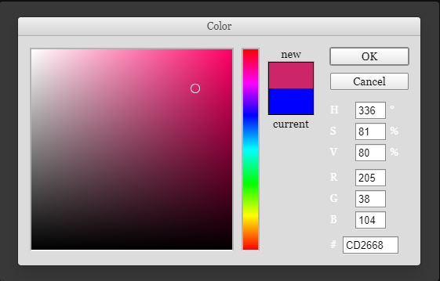

# react-admin-color-components

Color utility components for use in react-admin applications

## Installation

```
npm install react-admin-color-components --save
```

## Usage



This package provides a ColorInput component based on the [react-color](https://www.npmjs.com/package/react-color) pickers librray, as well as a corresponding ColorField and ColorSquare (which is used to display the current color in both aforementioned components) for use in a [react-admin](https://marmelab.com/react-admin/) application.

The ColorInput's default picker is the PhotoshopPicker, but the prop `picker` can be used to override the default. Additional props for the picker can be passed as part of `pickerOptions`.

The ColorInput accepts most react-admin input props, including `validate`, `defaultValue`, `fullWidth`, `helperText`, `sx`, etc., and (obviously) requires a `source` and a `label` to be defined in order to work correctly as a form input or filter.

The ColorInput uses a "fragile controlled" input strategy in which the current field value is stored in React state while the picker is open, and the field value is only updated once `onChangeComplete` is called, which is usually at the point of closing the picker. If the picker is closed without confirming, such as clicking `Cancel` on the Photoshop picker, the field value will not be updated.

This package is based on the previous work of [alexgschwend](https://github.com/alexgschwend) and [vascofg](https://github.com/vascofg), who built similar component libraries.

## Contributing

I welcome opened issues and pull requests! This package was primarily geared towards my particular needs, but I'd love to see it cover more use-cases and become useful to a wider audience.

## License

This library is licensed under the [MIT License](LICENSE).
